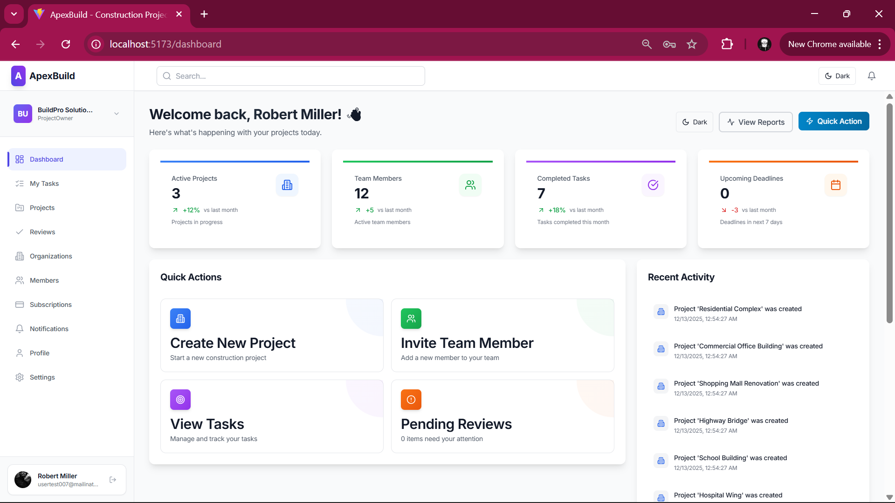
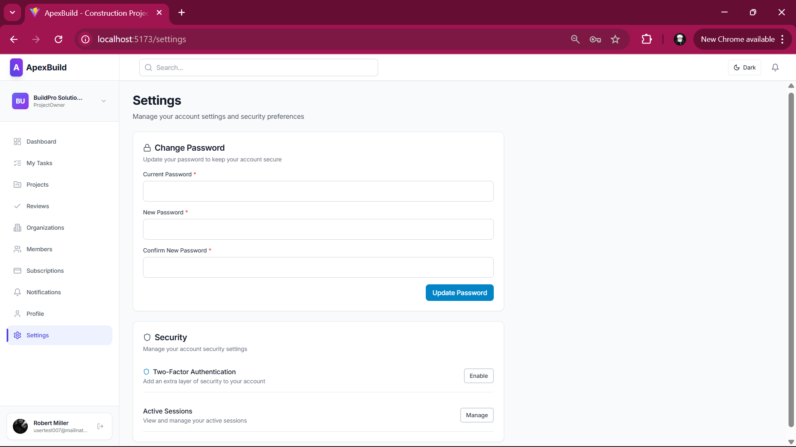

# ApexBuild Frontend

A modern, responsive React application for **ApexBuild** - a Construction Project Management and Tracking Platform.





<!-- Demo Video -->
<!-- Replace YOUR_VIDEO_URL with your Cloudinary video URL -->
<!-- https://YOUR_VIDEO_URL -->

## Features

- **Authentication** - Login, registration, email confirmation, password reset, JWT token management with auto-refresh
- **Two-Factor Authentication** - TOTP setup with QR code scanning and verification
- **Dashboard** - Real-time overview with active projects, team members, completed tasks, upcoming deadlines, quick actions, and recent activity feed
- **Organization Management** - Create/manage organizations, switch between organizations, view organization details and departments
- **Member Management** - Invite users via email, manage member roles, view member profiles and activity
- **Project Management** - Create projects, assign team members, track progress with status workflows
- **Task Management** - Create/assign tasks (multiple assignees), submit daily updates with media attachments, supervisor and admin review/approval workflows, task comments
- **Subscription & Billing** - Stripe-powered checkout, plan management, payment methods, proration previews, billing history, invoice details
- **Notifications** - Real-time notification feed with read/unread tracking
- **Media Gallery** - Image uploads, media viewing, and profile pictures via Cloudinary
- **Settings** - Password management, two-factor authentication toggle, active sessions
- **Dark Mode** - Theme toggle with system preference detection
- **Search** - Global search across organizations and projects
- **Error Handling** - Error boundaries, 404 pages, graceful error states

## Tech Stack

| Category | Technology |
|----------|-----------|
| **Framework** | React 19 |
| **Build Tool** | Vite 7 |
| **Routing** | React Router 6 |
| **Styling** | Tailwind CSS 3 |
| **HTTP Client** | Axios |
| **Forms** | React Hook Form + Zod validation |
| **Icons** | Lucide React |
| **Fonts** | Inter (via @fontsource) |
| **Utilities** | clsx + tailwind-merge |

## Project Structure

```
src/
├── components/
│   ├── layouts/              # AuthLayout, DashboardLayout
│   ├── subscription/         # Stripe modals, billing, invoices
│   ├── tasks/                # TaskFormModal
│   └── ui/                   # Button, Input, Card, Modal, Select,
│                             # Badge, Tabs, Spinner, Alert, EmptyState,
│                             # ImageUpload, MediaGallery, ProfilePicture
├── config/                   # API configuration
├── contexts/                 # AuthContext, OrganizationContext,
│                             # SubscriptionContext, ThemeContext
├── hooks/                    # useStripeCheckout
├── pages/                    # 22 page components
│   ├── Dashboard.jsx         # Main dashboard with metrics
│   ├── Login.jsx             # Authentication
│   ├── Register.jsx          # User registration
│   ├── Organizations.jsx     # Organization listing
│   ├── OrganizationDetail.jsx
│   ├── ProjectsList.jsx      # Project listing
│   ├── ProjectsNew.jsx       # Create project
│   ├── ProjectManagement.jsx # Project detail/management
│   ├── Tasks.jsx             # Task listing
│   ├── TaskDetail.jsx        # Task detail with updates
│   ├── MyTasks.jsx           # Personal task view
│   ├── TaskSubmission.jsx    # Submit daily updates
│   ├── Reviews.jsx           # Review task updates
│   ├── MemberManagement.jsx  # Team management
│   ├── MemberDetail.jsx      # Member profile
│   ├── InviteUser.jsx        # Send invitations
│   ├── Subscriptions.jsx     # Plan management
│   ├── Profile.jsx           # User profile
│   ├── Settings.jsx          # Account settings
│   ├── Notifications.jsx     # Notification feed
│   ├── SetupTwoFactor.jsx    # 2FA setup
│   └── VerifyTwoFactor.jsx   # 2FA verification
├── services/                 # API service modules
│   ├── api.js                # Base Axios instance with interceptors
│   ├── authService.js        # Auth endpoints
│   ├── organizationService.js
│   ├── taskService.js
│   ├── userService.js
│   ├── subscriptionService.js
│   ├── stripeService.js
│   ├── invoiceService.js
│   ├── mediaService.js
│   ├── notificationService.js
│   └── searchService.js
└── utils/
    └── cn.js                 # Tailwind class merging utility
```

## Getting Started

### Prerequisites

- Node.js 18+
- npm
- Backend API running (see [ApexBuild API](../ApexBuild-BE/))

### Installation

1. Clone the repository:
```bash
git clone <repo-url>
cd apexbuild-fe
```

2. Install dependencies:
```bash
npm install
```

3. Create a `.env` file:
```env
VITE_API_BASE_URL=https://localhost:44361/api
```

4. Start the development server:
```bash
npm run dev
```

5. Open `http://localhost:5173`

### Build for Production

```bash
npm run build
```

Output will be in the `dist/` directory.

## Available Scripts

| Command | Description |
|---------|-------------|
| `npm run dev` | Start development server |
| `npm run build` | Build for production |
| `npm run preview` | Preview production build |
| `npm run lint` | Run ESLint |

## Environment Variables

| Variable | Description | Default |
|----------|-------------|---------|
| `VITE_API_BASE_URL` | Backend API base URL | `https://localhost:44361/api` |

## License

This project is proprietary software.
